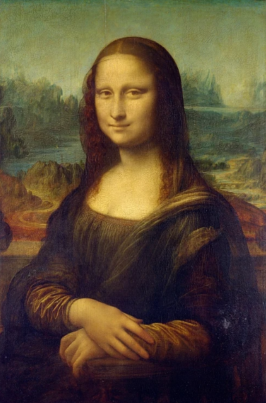
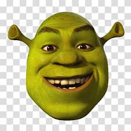
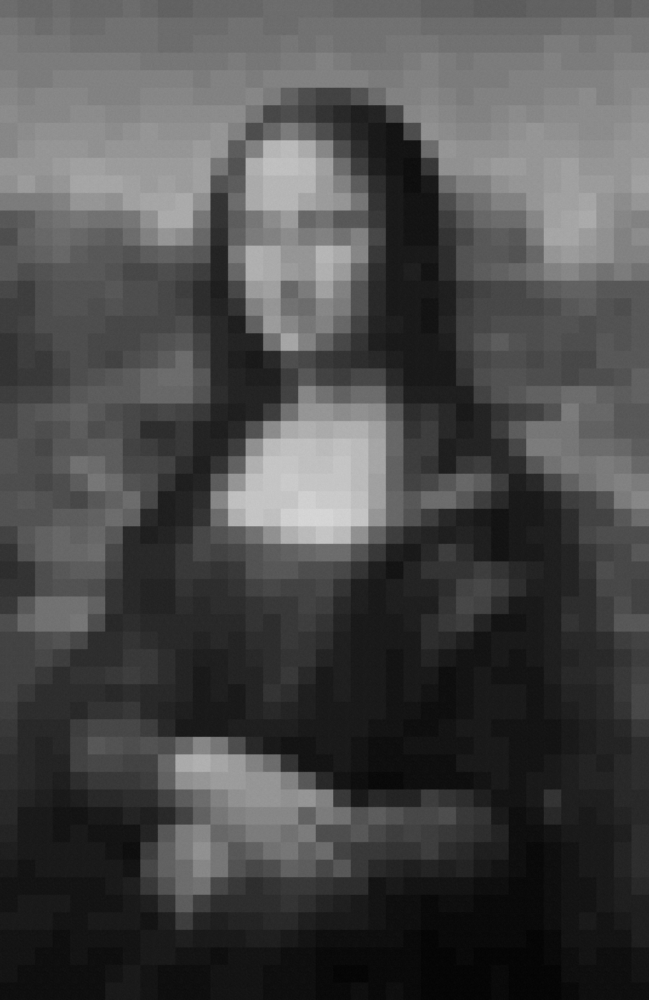

# 🧩 Image Mosaic Generator 🎨

A Python project that turns boring grayscale images into **photomosaics**, using either:
- A **single tile** (repeated and adjusted for brightness)
- Or a set of **multiple tile images** for more detailed results

---

## How It Works

This program:
1. Takes a **target image** (like Mona Lisa or your ex).
2. Uses a folder full of **tile images** (like memes, shrek pics, etc.).
3. Matches parts of the target image to the best matching tile based on **brightness**.
4. Builds a whole-ass mosaic that looks 🔥 from a distance, and cursed up close.

---

## Project Structure

```bash
Image-Mosaic-Generator/
│
├── tiles/                   # Folder of tile images (8x8 grayscale)
│   └── generate_tiles.py    # Script to generate tile images from any source
├── mona.png                 # Target image to be rebuilt (grayscale)
├── shrek.jpeg               # Image used for single-tile mosaic
├── photomosaic_output.png   # Output: Multi-tile mosaic
├── mosaic_cartman.png       # Output: Single-tile mosaic
├── main.py                  # Main Python script
└── README.md                # This sexy file you're reading
```             

## Requirements

```bash
pip install numpy pillow matplotlib
```

These packages do all the dirty work:

- `numpy` → crunches brightness math  
- `Pillow` → handles all your pixel crap  
- `matplotlib` → shows off the sexy output

---

## How to Run

### 1. Clone the Repo

```bash
git clone https://github.com/Shams-20/Image-Mosaic-Generator.git
cd Image-Mosaic-Generator
```

### 2️. Add Your Images

- Drop your target image as `mona.png` (Download from the repo OR rename yours to that).
- Drop a grayscale image for single-tile use as `shrek.jpeg`. (Or any image of your choice)
- Drop a bunch of grayscale tiles into the `tiles/` folder. (Run the Code present in /tiles folder)
- Tile size should be 8x8 pixels for best results.

---

## Output

After running `main.py`, you’ll get two beautiful nightmares:

- `mosaic_cartman.png` → The mosaic using the single tile (`shrek.jpeg`)  
- `photomosaic_output.png` → The multi-tile photomosaic using images from `tiles/`

---

## Image Previews 

  


  



## Tips

- Make sure all tiles are **grayscale** and the **same size**.  
- Shrink your **scale factor** in the code (e.g., `0.05`) for more detail.  
- Increase tile resolution (e.g., `16x16`) to reduce blur.  
- Run the tile generator on **diverse source images** for variety.
